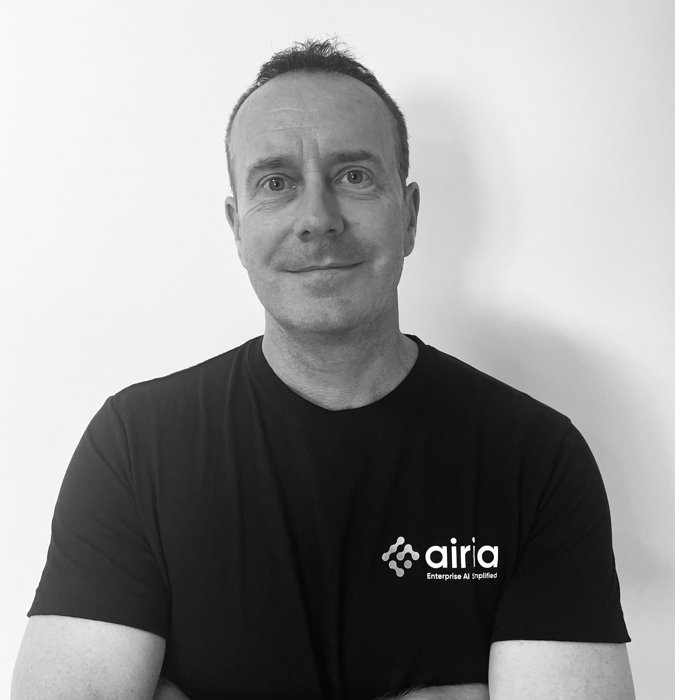

# My Profile
  
Anthony G Rees  
Solutions Engineer @ Airia AI - Enterprise AI Simplified.  
Greater Melbourne Area, Australia.     
  

  

## Experience in the IT Industry

I am a seasoned technology professional with extensive experience in Enterprise AI architecture, cloud security, and DevOps solutions across the APAC region. My career spans multiple leadership roles where I've helped organisations modernise their infrastructure and enhance their security posture.

### Current Role

**Solutions Engineer - APAC (Sept 2024 - Current)**  
Currently working as a Solutions Engineer at Airia AI a leading Enterprise Orchestration Platform, where I help organizations securely build, deploy, and manage AI solutions at scale. The platform seamlessly integrates with existing systems and data sources to transform workflows into intelligent AI agents while maintaining strict security and compliance standards.
  
  

### Previous Leadership Roles

**Field CTO - APAC at Lacework (Mar 2024 - Sept 2024)**  
I aligned Lacework's technology solutions with specific client security needs. I engage closely with customers to understand their existing security infrastructure, identify vulnerabilities, and recommend tailored solutions. I serve as a vital conduit between field and product development teams, providing critical feedback to shape the product roadmap and drive innovation.

**Principal Solutions Engineer at Lacework (Jul 2023 - Mar 2024)**  
I led complex projects and contributed to strategic decisions in APAC. Worked closely with Sales teams to understand customer requirements, demonstrate product capabilities, and bridge the gap between Sales and Product/Engineering teams. Regular public speaker at DevSecOps events, Conferences, and Security Podcasts.

**Senior Solutions Engineer / Cloud Alliances Manager - APAC at Lacework (Aug 2021 - Jul 2023)**  
Specialised in Lacework's cloud security data platform that delivers automated security and compliance across multi-cloud environments. Helped innovative companies like Snowflake and Airbnb accelerate development, consolidate cloud security tools, reduce costs by 35%, and significantly reduce legitimate threats.

**Senior Sales Engineer APAC - Cloud Alliances at Splunk (Feb 2021 - Aug 2021)**  
Integrated partner technologies with Splunk's portfolio of solutions within the Global Strategic Alliances team. Collaborated with multiple teams and large cloud platform SIs such as AWS & GCP to define partner strategy and assist with architecture and development initiatives.

**Regional Solutions Engineer / Architect - APAC at Chef Software (Aug 2017 - Jan 2021**  
Worked with customers across the APAC region to define, create and deliver automation strategies for infrastructure, application and compliance using platforms including Docker, Kubernetes, Mesosphere DC/OS, OpenStack, VMware, Azure, GCP and AWS.

### Core Expertise
- **Cloud Security:** Multi-cloud environments, compliance automation, vulnerability management
- **Enterprise AI:** AI orchestration platforms, intelligent agents, secure AI deployment and MCP
- **DevOps & Automation:** Infrastructure as code, application delivery, compliance automation
- **Solution Architecture:** Technical leadership, product roadmap influence, customer engagement
- **Public Speaking:** Regular presenter at industry events, security meetups, and podcasts

### Public Speaking & Presentations  

I'm a regular speaker at industry conferences, webinares, and events. Here are some of my notable presentations:

#### Recent Presentations  
  

**Marcus Evans - Anthony Rees from Airia AI 2025**  
Event interview and feedback.  

    
**DOTC 2022 - "Sort Your Shift (Left) Out"**  
  
DevOps Talks Conference Sydney 2022

  
  
**DOTC 2022 Interview**  
  
Interview with Regional Security Solutions Engineer at Lacework

  
#### DevOps & Security Focused Talks  
  
**DOTC Interview 2020**  
  
In today’s interview Anthony Rees from Chef Software talks about selecting the right tools to automate the enterprise. Anthony thinks organisations need to use code for everything, including images, provisioning and much more.  

    
**Chef Webinar - "Bring Security to DevOps"**   
  
OpenSource DevOps Tools that Play well Together  

   

**DevOpsDays Singapore 2018 - "Less Yak Shaving"**  
  
Less yak shaving with more DEV and SEC in your OPS  
[![DevOpsDays [Location2]](https://img.youtube.com/vi/vknxjy-U2ac/0.jpg)](https://youtu.be/vknxjy-U2ac)
   

**ChefConf Chicago 2018 - "HPE Synergy and Kubernetes"**  
  
Don't Burn Your Fingers with HPE Synergy and Kubernetes with Chef Automate

   

**DevOpsDays New Zealand 2017 - "DevSecOps"**  
  
DevSecOps – Delight with Compliance as Code
[![DevOpsDays [Location3]](https://img.youtube.com/vi/L4zILOnHLUk/0.jpg)](https://youtu.be/L4zILOnHLUk)
   

**DevOpsDays Highlights from Auckland 2017**  
  
Conference highlights and interviews

   
    
#### OpenStack & Infrastructure
   
    
**OpenStack Summit Austin TX 2016**   
  
Infrastructure as Code in OpenStack with Ansible
[![OpenStack [Person1]](https://img.youtube.com/vi/iTUopN6CTFs/0.jpg)](https://youtu.be/iTUopN6CTFs)
  

**OpenStack Day Australia Sydney 2016**  
  
Infrastructure as Code in OpenStack with Ansible
[![OpenStack Day [Location5]](https://img.youtube.com/vi/PGBPGvCJp5w/0.jpg)](https://youtu.be/PGBPGvCJp5w)

**OpenStack Day Government Canberra 2016** 
  
Government Main Feature Interviews

**OpenStack Enterprise Stories**
  
The 'Untold' OpenStack Enterprise Customer Stories

**Mission Critical OpenStack**
  
Mission Critical OpenStack implementations

**Linux Conf Auckland 2015**
  
OpenStack Operations for Engineers

**Open Source Developers Conference India 2014**
  
Change the Game with HP Helion OpenStack

**DevOps Talks Interview**
  
Interview with Google representatives

### Technical Portfolio
  
You can explore my technical work and contributions at [GitHub](https://github.com/anthonygrees)

---

*Passionate about helping organizations transform their technology landscape through innovative solutions in Australia, security, and automation.*
